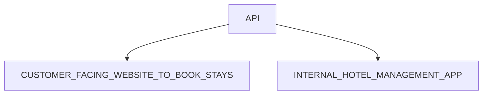

## What is The Wild Oasis?

> [!TIP]
> “The Wild Oasis” is a small boutique hotel with 8 luxurious wooden cabins  
> They need a custom-built application to manage
> everything about the hotel: bookings, cabins
> and guests  
> This is the internal application used inside the
> hotel to check in guests as they arrive
> They have nothing right now, so they also need
> the API  
> Later they will probably want a customer-facing
> website as well, where customers will be able to
> book stays, using the same API  

### API

# The-Wild-Oasis-Customer-Website

### Project Requirments:

- [ ] Users of the app are potential guests and actual guests
- [ ] Guests should be able to learn all about the Wild Oasis Hotel
- [ ] Guests should be able to get information about each cabin and seee booked dates
- [ ] Guests should be able to filter cabins by their maximum guest capacity
- [ ] Guest should be able to receive a cabin for a certain date range
- [ ] Reservation not paid online .Payment will be made at the property upon arrival. Therefore, new reservations should be set to "unconfirmed" (booked but not yet checked in).
- [ ] Guests should be able to view all their  past and feature reservations
- [ ] Guests should be able to update or delete reservation
- [ ] Guests need to sing up and login before they can reserve a cabin and perform any operation
- [ ] On sing up,each guest should get profile in the DB
- [ ] Guest should be able to set and update basic data about their profile to make check-in at the hotel faster

### FEATURES+PAGES

| Feature Category | Necessary pages  | URL Params          |
| ---------------- | ---------------- | ------------------- |
|Homepage     |     Homepage            |       /       |
| About        | About page        | /about          |
| Cabins           | Cabin overview          | /cabins/            |
| Cabins           | Cabin details          | /cabins/:cabinId            |
| Reservations    | Cabin details     | /cabins/:cabinId         |
| Reservations    | Reservation list     | /account/reservations         |
| Reservations    | Edit reservation      | /account/reservations/edit         |
| Authentication   | Login            | /login              |
| profile   | update profile | /account/profile            |

### Technologies and Tools:

&nbsp;
&nbsp;
&nbsp;
&nbsp;
&nbsp;
&nbsp;
&nbsp;
&nbsp;
